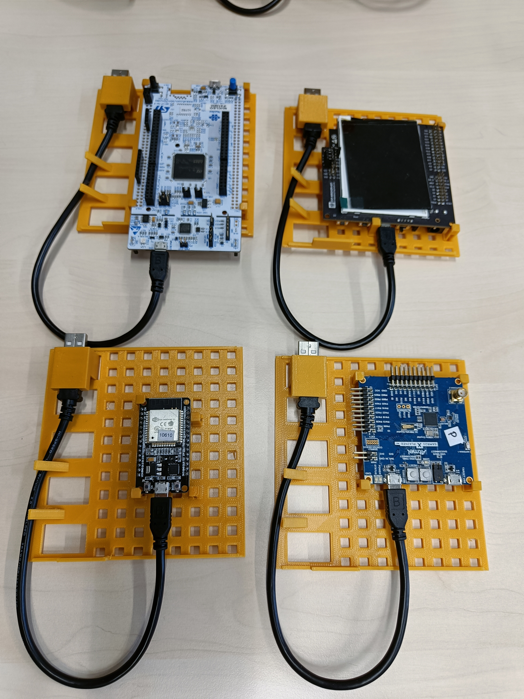

# inet-mbh
The Modular Board Holder design for the inet-nm from the INET working group.

## Purpose
The goal of this (aside from learning) is to create a stackable, expandable case
to hold the many different types of embedded development kits we use.
We would like to have an easy way to connect and disconnect these development
kits to a server via USB hubs (similar to quick swap HDDs or drives).


## Glossary
- `mbh` (Modular Board Holder) - The overall project
- `mc` (Modular Container) - The large box that interconnects
- `bh` (Board Holder) - The flat slot that the board and usb will clip into
- `ube` (USB Bunny Ears) - The spring mechanism to push the usb cable up
- `uc` (USB Cap) - The usb specific cap that clips in over top of the usb casing
- `cbc` (Corner Board Clip) - A clip that connects to bh that holds the corner of boards
- `sbc` (Side Board Clip) - A clip that connects to bh that holds the side of boards

## Misc
The only thing that will need to be adapted is the `uc`, this will be adjusted
by replacing parameters in the spreadsheet.
The manufacturer name should be included in the namespace or just a number
if manufacturer name is unavailable.

## Requirements

Software version used to model this:
```
FreeCAD_0.20.2-2022-12-27-conda-Linux-x86_64-py310.AppImage
```

USB cable
```
Manufacturer: Stewart Connector
Manufacturer Product Number: SC-2AMK001
url: https://www.digikey.de/en/products/detail/stewart-connector/SC-2AMK001F/8544576
```

Panel Mount USB connector
```
Manufacturer Product Number: 4055
Manufacturer: Adafruit Industries LLC
url: https://www.digikey.de/en/products/detail/adafruit-industries-llc/4055/10107220
```

USB Hub (has power control with [uhubctl](https://github.com/mvp/uhubctl))
```
Manufacturer Product Number: HU9003V1EBL
Manufacturer: Amazon Basics
url: https://www.amazon.de/-/en/Amazon-Basics-Ports-Power-Adapter/dp/B076YKYHCB/ref=sr_1_1?crid=WG8Y976FZ4DN&keywords=HU9003V1EBL&qid=1695201660&sprefix=hu9003v1ebl%2Caps%2C189&sr=8-1
```

## Flashy Pictures

20 connected with 5 `mc`s offset


Different form factor boards


Empty `mc`


All the different pieces:


## Roadmap

- Add more board clip variants to better fit possible boards.
- Create a "service" where some basic parameters are entered and out pops an
stl for those given parameters, eliminating the need for any setup or tuning.\
- Try to make a more generic `uc` so everything is can be swapped.
- Add a usb hub holder solution.
- Refactor and improve the FreeCAD modelling.
- Automate releases to provide all the stl files in a reproducible way.
- Allow for vendor independent USB chassis clip.
- Add a place to label the `mc` for location
